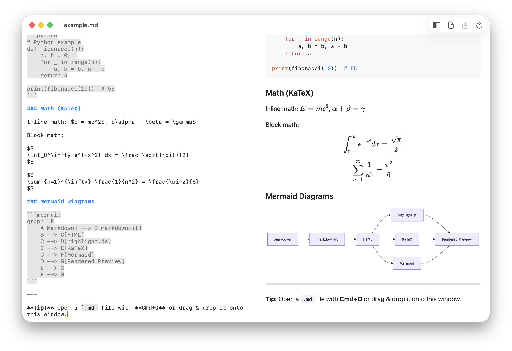
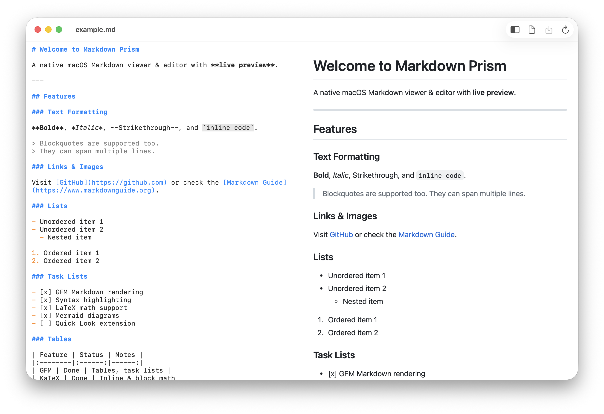
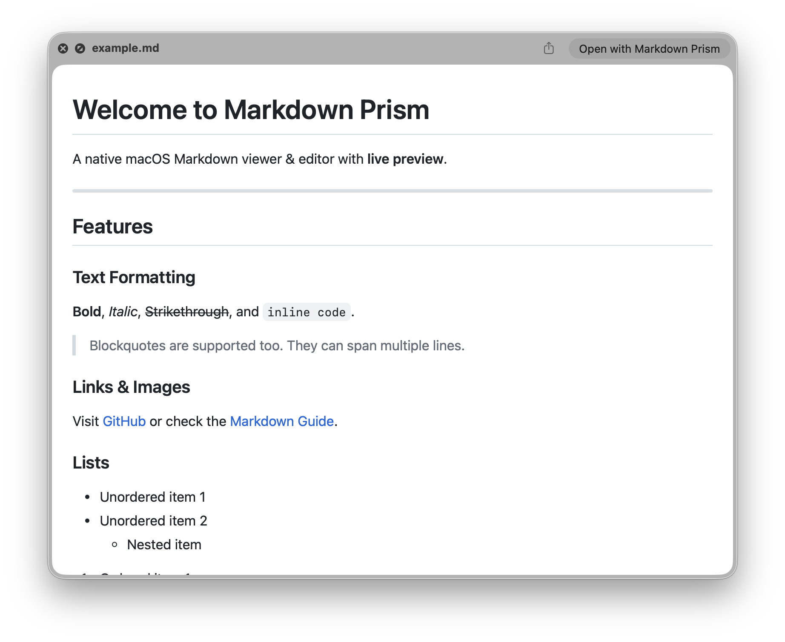

# Markdown Prism

> **Homepage:** [prism.huconn.xyz](https://prism.huconn.xyz)

A native macOS Markdown viewer & editor with live preview, Quick Look support, and rich rendering.



## Features

- **Live Preview** — Split-pane editor with real-time rendered preview
- **GFM Support** — Tables, task lists, strikethrough, autolinks
- **Syntax Highlighting** — 180+ languages via highlight.js
- **LaTeX Math** — Inline (`$...$`) and block (`$$...$$`) math with KaTeX
- **Mermaid Diagrams** — Flowcharts, sequence diagrams, and more
- **Quick Look** — Preview `.md` files in Finder with spacebar
- **File Watching** — Auto-refreshes when the file changes on disk
- **Dark Mode** — Follows system appearance

## Screenshots

### Editor + Preview



### Quick Look



## Install

### Homebrew

```bash
brew install hulryung/tap/markdown-prism
```

### Manual

Download the latest `MarkdownPrism-x.x.x.dmg` from [Releases](../../releases), open it, and drag **Markdown Prism** to Applications.

The app is signed and notarized with Apple Developer ID.

## Build from Source

Requires macOS 14+ and Xcode 15+.

```bash
# Install xcodegen (if needed)
brew install xcodegen

# Generate Xcode project and build
xcodegen generate
xcodebuild -scheme MarkdownPrism -configuration Release build
```

For SPM-only build (no Quick Look extension):

```bash
swift build
swift run
```

## Tech Stack

| Component | Technology |
|-----------|-----------|
| App Shell | Swift / SwiftUI |
| Preview Rendering | WKWebView + HTML/JS |
| Markdown Parser | markdown-it |
| Code Highlighting | highlight.js |
| Math Rendering | KaTeX |
| Diagrams | Mermaid.js |
| Quick Look | QLPreviewingController + WKWebView |

## License

MIT
