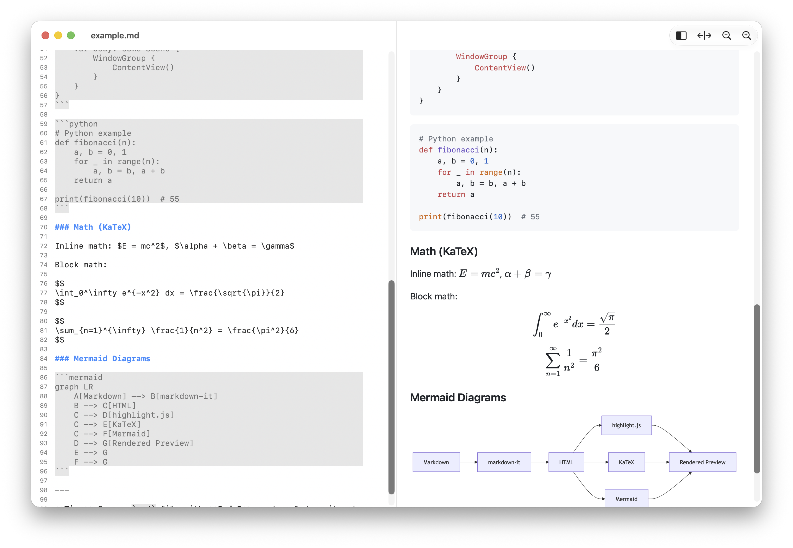
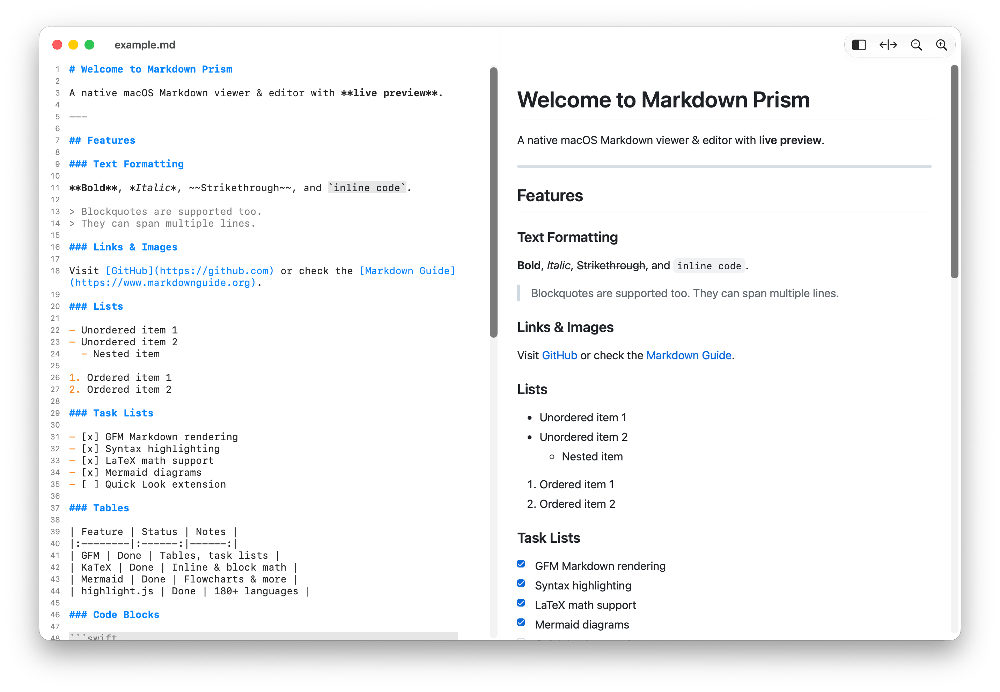
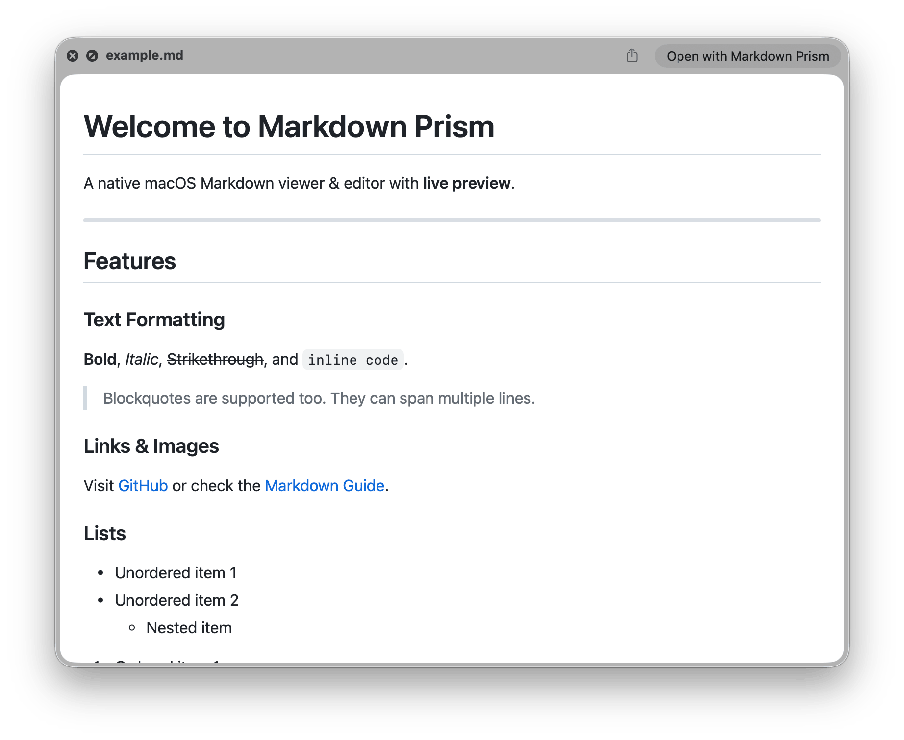

# Markdown Prism

> **Homepage:** [prism.hulryung.com](https://prism.hulryung.com)

A native macOS Markdown viewer & editor with live preview, Quick Look support, and rich rendering.



## Features

- **Live Preview** — Split-pane editor with real-time rendered preview
- **Scroll Sync** — Editor and preview follow each other, both ways
- **Line Numbers** — Gutter alongside the editor
- **Tabs & Windows** — A document per window, merged into tabs when you want
- **GFM Support** — Tables, task lists, strikethrough, autolinks
- **Syntax Highlighting** — 180+ languages via highlight.js
- **LaTeX Math** — Inline (`$...$`) and block (`$$...$$`) math with KaTeX
- **Mermaid Diagrams** — Flowcharts, sequence diagrams, and more
- **Find & Replace** — Across both panes, with regular expressions
- **Quick Look** — Preview `.md` files in Finder with spacebar
- **File Watching** — Auto-refreshes when the file changes on disk
- **Encoding Safe** — UTF-8, UTF-16/32 and Latin-1 files are saved as they were read
- **Themes** — Follow the system, or pin light or dark
- **Fonts** — Pick the editor and preview faces and sizes in Settings

Everything renders offline: the parser, highlighter, math and diagram libraries
are all bundled in the app.

## Screenshots

### Editor + Preview



### Quick Look



## Install

Requires macOS 14 (Sonoma) or later.

### Homebrew

```bash
brew install --cask hulryung/tap/markdown-prism
```

### Manual

Download the latest `MarkdownPrism-x.x.x.dmg` from [Releases](../../releases), open it, and drag **Markdown Prism** to Applications.

The app and the disk image are both signed with an Apple Developer ID and
notarized, so Gatekeeper lets them through without asking Apple first.

<details>
<summary>Homebrew install fails with "the App source ... is not there"</summary>

A cask naming bug fixed in v0.4.7 can leave older installs in a broken state.
Clear it and reinstall:

```bash
brew uninstall --cask markdown-prism --force
brew tap hulryung/tap --force
brew install --cask hulryung/tap/markdown-prism
```

</details>

## Keyboard Shortcuts

Alongside the standard document shortcuts (`Cmd+N`, `Cmd+O`, `Cmd+S`, `Cmd+W`):

| Shortcut | Action |
|----------|--------|
| `Cmd+Shift+E` | Show/hide the editor pane |
| `Cmd+F` | Find |
| `Cmd+G` / `Cmd+Shift+G` | Find next / previous |
| `Cmd+Option+F` | Find & Replace |
| `Cmd+=` / `Cmd+-` / `Cmd+0` | Zoom in / out / actual size |

## Build from Source

Requires macOS 14+ and Xcode 15+.

```bash
# Install xcodegen (if needed)
brew install xcodegen

# Generate the Xcode project and build, Quick Look extension included
xcodegen generate
xcodebuild -scheme MarkdownPrism -configuration Release CODE_SIGNING_ALLOWED=NO build
```

SwiftPM builds and tests the app target, but cannot build app extensions, so it
leaves out Quick Look:

```bash
swift build
swift test
```

Releases are cut with `./scripts/build-dmg.sh`, which signs, notarizes, staples
and packages the DMG. `project.yml` holds the version; both `Info.plist` files
are generated from it.

## Tech Stack

| Component | Technology |
|-----------|-----------|
| App Shell | Swift / SwiftUI |
| Document Model | DocumentGroup + FileDocument |
| Editor | NSTextView with regex-based highlighting |
| Preview Rendering | WKWebView + HTML/JS |
| Markdown Parser | markdown-it |
| Code Highlighting | highlight.js |
| Math Rendering | KaTeX |
| Diagrams | Mermaid.js |
| Sanitiser | DOMPurify |
| Quick Look | QLPreviewingController + WKWebView |

## License

[MIT](LICENSE).

The app bundles its parser, highlighter, maths and diagram libraries so it can
render offline; those are redistributed under their own licences, listed in
[THIRD-PARTY-NOTICES.md](THIRD-PARTY-NOTICES.md).
