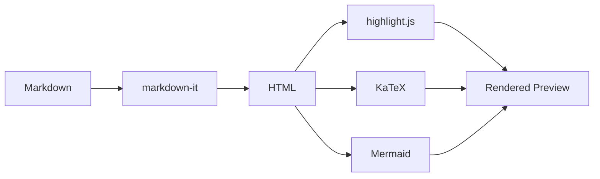

# Welcome to Markdown Prism

A native macOS Markdown viewer & editor with **live preview**.

---

## Features

### Text Formatting

**Bold**, *Italic*, ~~Strikethrough~~, and `inline code`.

> Blockquotes are supported too.
> They can span multiple lines.

### Links & Images

Visit [GitHub](https://github.com) or check the [Markdown Guide](https://www.markdownguide.org).

### Lists

- Unordered item 1
- Unordered item 2
  - Nested item

1. Ordered item 1
2. Ordered item 2

### Task Lists

- [x] GFM Markdown rendering
- [x] Syntax highlighting
- [x] LaTeX math support
- [x] Mermaid diagrams
- [ ] Quick Look extension

### Tables

| Feature | Status | Notes |
|:--------|:------:|------:|
| GFM | Done | Tables, task lists |
| KaTeX | Done | Inline & block math |
| Mermaid | Done | Flowcharts & more |
| highlight.js | Done | 180+ languages |

### Code Blocks

```swift
// Swift example
struct MarkdownPrism: App {
    var body: some Scene {
        WindowGroup {
            ContentView()
        }
    }
}
```

```python
# Python example
def fibonacci(n):
    a, b = 0, 1
    for _ in range(n):
        a, b = b, a + b
    return a

print(fibonacci(10))  # 55
```

### Math (KaTeX)

Inline math: $E = mc^2$, $\alpha + \beta = \gamma$

Block math:

$$
\int_0^\infty e^{-x^2} dx = \frac{\sqrt{\pi}}{2}
$$

$$
\sum_{n=1}^{\infty} \frac{1}{n^2} = \frac{\pi^2}{6}
$$

### Mermaid Diagrams



---

**Tip:** Open a `.md` file with **Cmd+O** or drag & drop it onto this window.